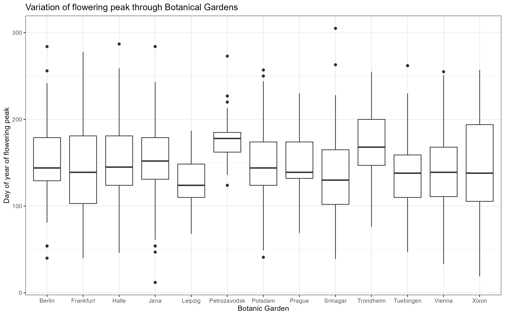

```{r setup, include=FALSE}
knitr::opts_chunk$set(echo = TRUE)
```

## Introduction

Botanic gardens have played an important role in the popularization of plant biology in occidental societies for already several decades [@krishnanRoleBotanicGardens2017].They help bridge the gap between scientists and the general public.

However, these island of green can also be useful to scientists and are an important source of phenological data [@primackGrowingVitalRole2021]. With climate change affecting plant communities and causing populational and phenological shifts [@vellendPlantResponsesClimate2021], these places regrouping plant individuals from everywhere in the world subjected to variable environmental conditions in different biomes are a window on plant species' capability to withstand changes. That special setting gives meaning to the existence of the **PhenObs initiative** (Phenological Observation Network) [@nordtPhenObsInitiativeStandardised2021]. It is a collaborative research project designed to track and monitor plant phenology in these particular and rich sites that are botanic gardens. PhenObs focuses on gathering detailed observations on plant phenology across multiple biomes to understand how climate change and other environmental factors impact vegetation and biodiversity.

This initiative relies on data collected by researchers and citizen scientists in various cities from around the globe (though mostly in Europe).

## Methods

Different phenological traits were measured for common species found in a wide selection of botanical gardens from across the world. Indeed, the flowering onset, flowering peak and senescence of the plant were systematically noted for every population sampled.

## Results

```{r table, echo=FALSE, fig.cap="Table: Data from the CSV file"}

# Load the CSV file
library(knitr)
table <- read.csv("../03_figures/table_peak_fl_sen.csv",stringsAsFactors = FALSE, encoding = "UTF-8")
table <-data.frame(lapply(table, as.character), stringsAsFactors = FALSE)


# Display the table with a caption

knitr::kable(table, format = "simple", caption = "Peak of flowering and senescence for Achillea Millefolium in different gardens")

```



Figure 1 : Comparison of flowering peak at all sampled Botanic Gardens

## Discussion

In the PhenObs experiment, latitude serves as a reliable proxy for climate variation because it is closely linked to temperature and seasonal changes, which influence plant phenology. As expected, longitude, however, is less effective as a proxy for climate change, as it does not capture the same consistent environmental gradients due to differing continental influences, ocean currents, and topography. Therefore, while latitude strongly affects plant responses to climate, longitude contributes more indirectly through localized climate conditions.

## Bibliography


